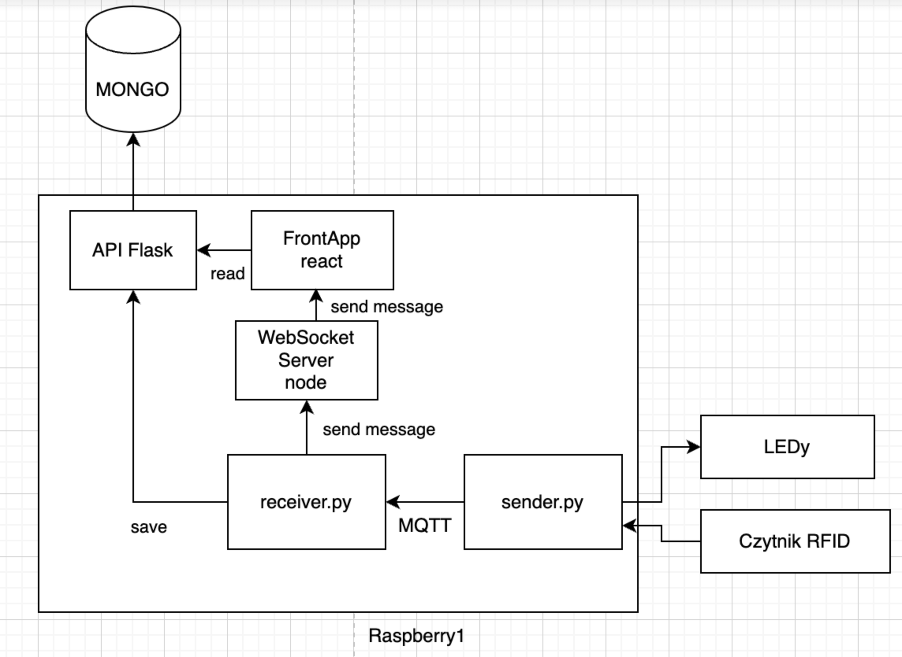

# IOT_RFID_Project

<table>
  <tr>
    <td>
      <a href="https://github.com/piotrwojdan"> <b>Piotr Wojdan</b></a>
    </td>
    <td>      <a href="https://github.com/Jakub-Radzik"> <b>Jakub Radzik</b></a></td>
    <td>
      <a href="https://github.com/boonku"> <b>Szymon Bąk</b></a></td>
    <td>
      <a href="https://github.com/29379"> <b>Jakub Krupiński</b></a>
      </td>
  </tr>
</table>

